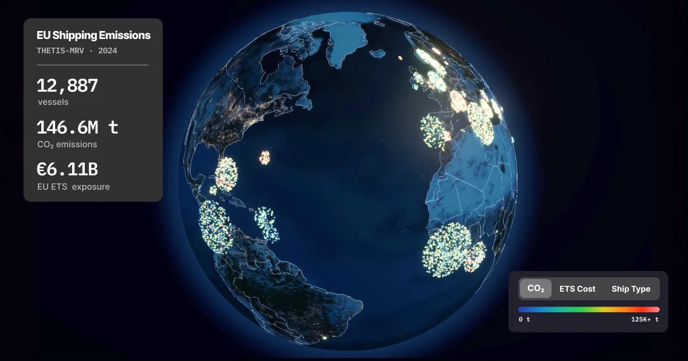

# Seafloor

An interactive 3D globe visualizing seven years of EU shipping emissions data. ~12,000 vessels per year, 2018–2024. Filter by ship type and flag state, search vessels and companies, and switch between CO₂ emissions, EU ETS cost, and ship type views.

**[seafloor.pages.dev](https://seafloor.pages.dev/)**



## What you can do

- Browse ~86,000 vessel-year records across 2018–2024
- Search by vessel name, IMO number, or company — camera flies to the result
- Select a company to highlight its entire fleet across flag states
- Toggle between CO₂ total, EU ETS cost (2024 only), and ship type color modes
- Filter by ship type or flag state
- Slide through years to watch fleet patterns shift (including the 2020–2021 dip)

## How it works

All vessels render in a single `InstancedMesh` draw call. Data is stored as binary `Float32Array` buffers (~500KB/year) that load directly into GPU buffer attributes — no JSON parsing at render time. A custom vertex shader handles billboard rendering, zoom-dependent sizing, and intro animation. Year switching swaps buffer attributes without rebuilding geometry.

For a deeper technical writeup, see [the blog post](https://www.marcohaber.dev/blog/seafloor).

## Data

All data comes from [THETIS-MRV](https://mrv.emsa.europa.eu/#public/emission-report), the EU's public ship emissions database. Annual Excel files, freely available, no API key needed.

The dataset has no voyage-level location data — only annual aggregates per vessel. Vessels are positioned at their flag state's centroid (a major port city), with deterministic jitter based on IMO number so same-flag vessels cluster naturally. EU ETS cost data only exists from 2024 onward.

## Stack

| Layer | What |
|-------|------|
| Framework | Next.js 16, React 19, TypeScript |
| 3D | react-three-fiber 9, Three.js 0.183, drei, postprocessing |
| Globe | three-globe |
| State | Zustand 5 |
| Styling | Tailwind CSS 4 |
| Data pipeline | Python 3, uv |
| Runtime | Bun |
| Hosting | Cloudflare Pages (static export) |

## Running locally

```bash
bun install
bun dev
```

Opens at `http://localhost:3000`. Processed data is already in `public/data/`, so you don't need the pipeline to get started.

## Data pipeline

Three scripts convert raw THETIS-MRV Excel files into binary GPU buffers:

```bash
uv run --project scripts python scripts/parse_thetis.py data/raw/2024.xlsx data/processed/2024.json
uv run --project scripts python scripts/geo_lookup.py
uv run --project scripts python scripts/build_binary.py
```

Each year produces a `.bin` buffer (GPU-ready) and an `index-YYYY.json` for UI metadata.

## License

MIT